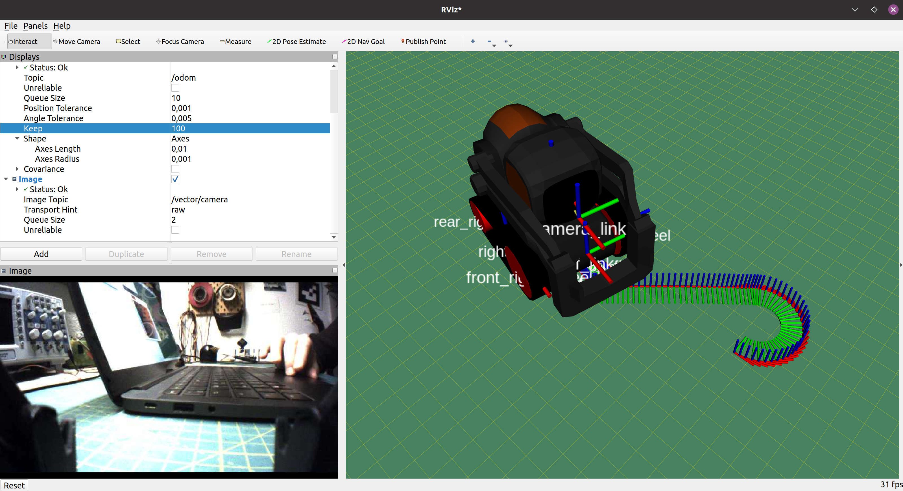
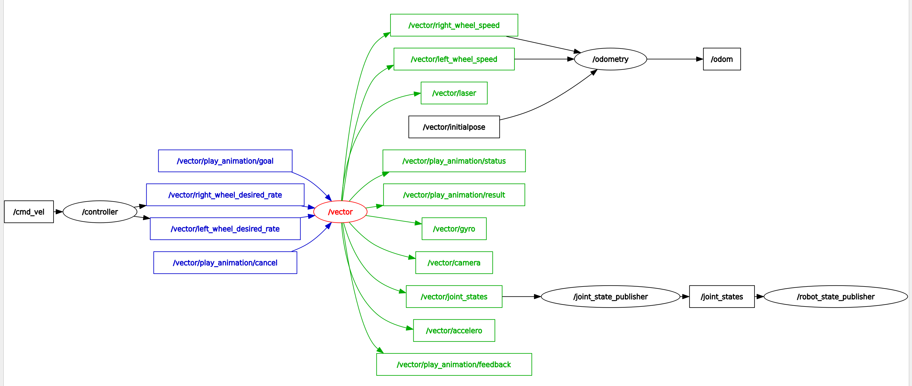

# vector_ros_driver
This package contains ROS python wrappers to exploit the features of Anki Vector SDK interfacing the physical robot.
In [nilseuropa/anki_description](https://github.com/nilseuropa/anki_description) you can find a detailed URDF model prepared for Gazebo simulation.




## Prerequisites

### SDK Setup

Get the Vector SDK if you don't have it already with `python3 -m pip install --user anki_vector`.
Run the `sdk_auto_config.sh` script to save the Anki SDK certification file to your disk.


## ROS-Noetic Setup

Python3 is the default interpreter since Noetic. Just clone the master branch of this repo into a catkin workspace, after building you should be ready to go.


## ROS-Melodic Setup

Please check out `melodic-devel` branch for this to work.

### Install required dependencies

`apt-get install` the following packages:
* python3-yaml
* python3-pip
* python3-dev
* python3-numpy
* python-catkin-tools
* python3-catkin-pkg-modules
* libopencv-dev

```bash
sudo apt install python3-yaml python3-pip python3-dev python3-numpy python-catkin-tools python3-catkin-pkg-modules libopencv-dev
```

`pip3 install` these:
* opencv-python
* rospkg
* catkin_pkg

### Build **cv_bridge** for python 3.6
```bash
mkdir rospy3_cv_bridge_ws
cd /rospy3_cv_bridge_ws
catkin init
catkin config -DPYTHON_EXECUTABLE=/usr/bin/python3.6 -DPYTHON_INCLUDE_DIR=/usr/include/python3.6m -DPYTHON_LIBRARY=/usr/lib/x86_64-linux-gnu/libpython3.6m.so
catkin config --install
git clone https://github.com/ros-perception/vision_opencv.git src/vision_opencv
cd src/vision_opencv/
git checkout melodic
cd ../../
catkin build cv_bridge
```
Best to add `source ~/rospy3_cv_bridge_ws/install/setup.bash --extend` to your `.bashrc`


## Vector ROS driver usage

Clone this repository into your regular ROS catkin workspace and run `roslaunch vector_ros_driver driver.launch`

It should look like this when running properly:

```bash
process[vector-4]: started with pid [29378]
process[controller-5]: started with pid [29379]
process[odometry-6]: started with pid [29380]
[INFO] [1608744266.101066]: /controller started
[INFO] [1608744266.208674]: /odometry started
18:24:26.534          robot.AsyncRobot WARNING  No serial number or name provided. Automatically selecting 00908a64
18:24:26.536     connection.Connection    INFO  Connecting to 192.168.0.150:443 for Vector-S7J2 using /home/nils/.anki_vector/Vector-S7J2-00908a64.cert
18:24:29.321     connection.Connection    INFO  BehaviorControl control_granted_response { }

```

_Corresponding graph:_


### Topics
* `/vector/camera`  *(sensor_msgs/Image)*

* `/vector/left_wheel_ticks` *(std_msgs/Int32)*

* `/vector/right_wheel_ticks` *(std_msgs/Int32)*

* `/vector/left_wheel_desired_rate` *(std_msgs/Int32)*

* `/vector/right_wheel_desired_rate` *(std_msgs/Int32)*

* `/vector/gyro` *(geometry_msgs/Vector3)*

* `/vector/accelero` *(geometry_msgs/Vector3)*

* `/vector/laser` *(sensor_msgs/Range)*

### Services

* `/vector/battery_state`

* `/vector/set_head_angle`

* `/vector/set_lift_height`

* `/vector/anim_list`

* `/vector/say_text`

### Actions

* `/vector/play_animation`


## FAQ

#### Can’t find robot name
Your Vector robot name looks like “Vector-E5S6”. Find your robot name by placing Vector on the charger and double-clicking Vector’s backpack button.

#### Can’t find serial number
Your Vector’s serial number looks like “00e20142”. Find your robot serial number on the underside of Vector. Or, find the serial number from Vector’s debug screen: double-click his backpack, move his arms up and down, then look for “ESN” on his screen.

#### Can’t find Vector’s IP address
Your Vector IP address looks like “192.168.40.134”. Find the IP address from Vector’s debug screen: double-click his backpack, move his arms up and down, then look for “IP” on his screen.


## Credits

Most content of this repository has been originally created by [betab0t](https://github.com/betab0t).
